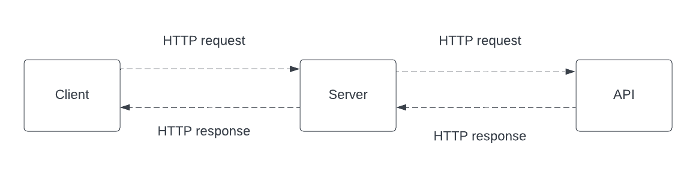

# Movies Library - 1.0.0

**Author Name**: Tasneem Al-Hassasneh

## WRRC



## Overview
Movies-Library is a simple Node.js web application that provides a list of movies and favorite page. It utilizes The Movie DB API to fetch movie data and supports various routes for retrieving trending movies, searching movies, discovering movies based on criteria, and retrieving detailed information about specific movies.

## Getting Started
To build this app on your own machine and get it running, follow these steps:

1. Clone the repository to your local machine.
2. Install the required dependencies by running `npm install`.
3. Obtain an API key from The Movie DB API (https://www.themoviedb.org/) by creating an account and following their documentation.
4. Create a `.env` file in the project directory and add the following line, replacing `YOUR_API_KEY` with your actual API key:
5. Update the `.gitignore` file to include `.env` so that your API key is not exposed in your repository.
6. Start the server by running `npm start`.
7. Open your web browser and navigate to `http://localhost:3000` to access the Movies-Library application.
8. Set up your Postgres database and update the connection details in the `db.js` file.
9. Start the server by running `npm start`.
10. Create request to the database for the following endpoints:
11. `/addMovie` - POST Request
Create a post request to save a specific movie to the database along with personal comments.
- Request:
  - Method: POST
  - Endpoint: `/addMovie`
  - Body Parameters:
    - `title` (string): The title of the movie.
    - `comments` (string): Personal comments about the movie.
12. `/getMovies` - GET Request
Create a get request to retrieve all data from the database.
- Request:
  - Method: GET
  - Endpoint: `/getMovies`
- Response:
  - Status: 200 OK
  - Body:
    ```json
    {
      "movies": [/* Array of movies from the database */]
    }
    ```